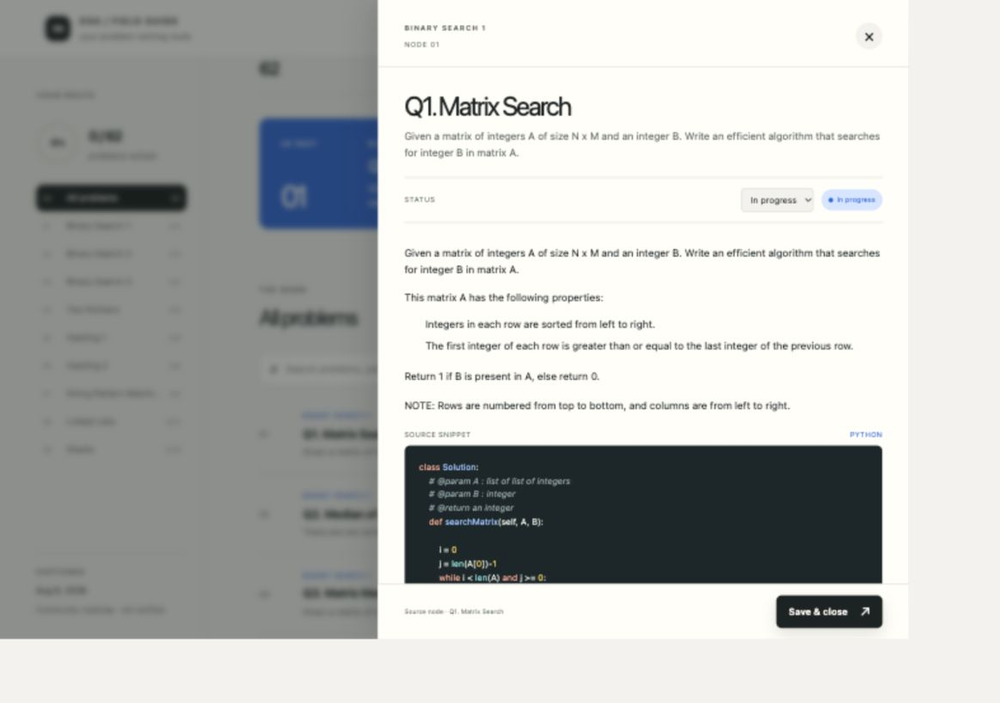

# DSA Field Guide

A searchable study workspace for Umar Farooque’s DSA roadmap: **62 problems**, **9 sections**, and **68 original snippets**.

Browse problems, filter by study status, track attempts, complete checklists, and save notes. Python snippets have syntax highlighting with a theme matched to the original interface. Progress is saved in your browser’s local storage.



## Run locally

Requires Node.js **22.13.0 or newer** and npm.

```sh
npm ci
npm run dev
```

Open the local URL printed by the development server.

```sh
npm run check     # snippet integrity, type checking, production build, worker smoke test
npm run start     # serve the production build
npm run package   # create a source archive in artifacts/
```

## Original code, preserved

`public/data/roadmap.json` is the original captured content. No snippet has been corrected, reformatted, trimmed, or rewritten. Highlighting adds escaped token spans only when rendering Python code. The seven text examples retain plain-text rendering. Unknown languages also fall back to the original text.

`tests/fixtures/original-snippets.json` records each original snippet’s ID, language, and SHA-256 checksum. Tests verify all 68 snippets against that baseline and check that stripping highlighting markup recovers every original character, including whitespace.

## Project layout

- `app/page.tsx` — browsing, filtering, and local study progress.
- `app/components/SyntaxHighlightedCode.tsx` — memoized code presentation.
- `app/lib/highlight-code.ts` — highlight.js core with only the Python grammar.
- `app/globals.css` — the original interface and scoped code colors.
- `public/data/` — roadmap content and its schema.
- `tests/` — snippet-preservation and production-render checks.
- `.github/workflows/ci.yml` — reproducible checks and source archive artifact.

Built with React, TypeScript, Vinext/Vite, and a Cloudflare Worker entry point. The retained `.openai/hosting.json` identifies the existing Sites project; uploading this repository does not redeploy that site. Optional D1 examples are retained from the starter, but this app uses no database.

## Source and storage

Content was captured on **August 6, 2026** from [Umar’s community DSA roadmap](https://roadmap.sh/r/dsa-roadmap-tdko4). The source marks the roadmap as unverified; snippets may be incomplete or contain errors. They are learning material and are displayed exactly as captured.

Study notes and progress stay in the current browser and device. They are not synced to GitHub or a server; clearing browser storage removes them. The repository contains the captured roadmap, not your browser’s saved study progress.

## Release archive

`npm run package` creates `artifacts/dsa-field-guide-v1.0.0-source.tar.gz` and a SHA-256 sidecar. The archive includes tracked source and documentation, excluding dependencies, build output, credentials, caches, and local progress. Extract it, then run `npm ci` and `npm run dev`.

## Dependency checks

Runtime dependencies passed `npm audit --omit=dev` with zero reported vulnerabilities on October 8, 2026. The inherited build and development toolchain still has 18 reported advisories (11 high, 7 moderate); npm’s suggested automatic fixes require incompatible downgrades. Compatible patches have been applied, and the remaining findings are recorded here rather than forcing framework changes. Recheck with `npm audit` as upstream fixes become available.
